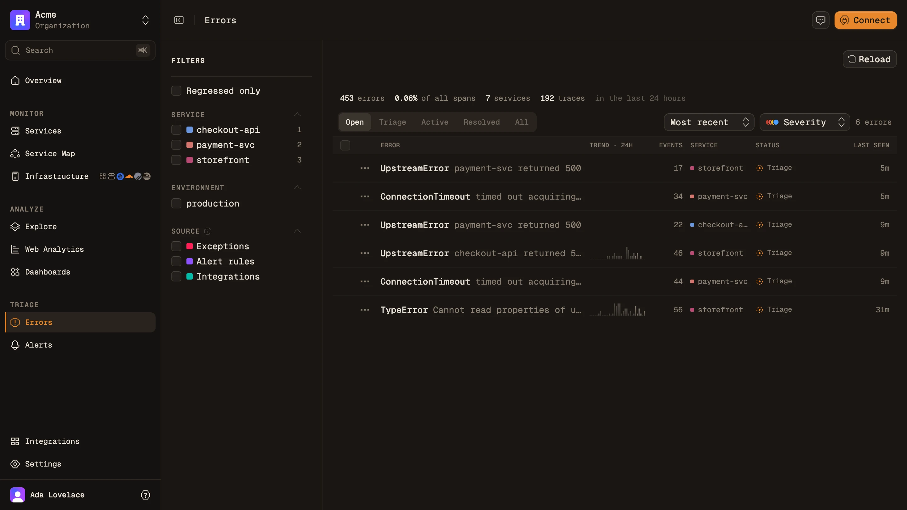

<p align="center">
  
</p>

<p align="center">
  <strong>Open-source observability for traces, logs &amp; metrics, built on OpenTelemetry and ClickHouse.</strong>
</p>

<p align="center">
  <a href="https://maple.dev">Website</a> ·
  <a href="https://maple.dev/docs">Docs</a> ·
  <a href="docs/local-mode.md">Run locally</a> ·
  <a href="https://maple.dev/changelog">Changelog</a> ·
  <a href="https://maple.dev/brand">Brand</a>
</p>

## Why Maple

- **OpenTelemetry native.** Point any OTLP exporter at Maple. No proprietary agent, no vendor SDK lock-in.
- **Traces, logs and metrics in one place.** Waterfalls, log search, metric explorers and dashboards share the same filters and time range.
- **Built for agents.** A hosted MCP server lets Claude Code, Cursor and other clients query your telemetry, and investigations run an agent over it for you.
- **Errors, alerts and replays.** Error issues with a triage lifecycle, alert rules that notify PagerDuty, Discord, Telegram, email or a webhook, and browser session replay.
- **Runs where you want.** Use [maple.dev](https://maple.dev), self-host the stack, or run everything as one local binary.

## Screenshots

<table>
  <tr>
    <td width="50%"><br /><sub><b>Traces.</b> Span waterfall with attributes, logs and infrastructure per span.</sub></td>
    <td width="50%"><br /><sub><b>Service map.</b> Live dependencies with request rate, error rate and latency on every edge.</sub></td>
  </tr>
  <tr>
    <td width="50%"><br /><sub><b>Logs.</b> Search and facet logs, jump straight to the trace that emitted them.</sub></td>
    <td width="50%"><br /><sub><b>Agents.</b> Ask why a service is erroring; the agent reads traces, logs and code to answer.</sub></td>
  </tr>
  <tr>
    <td width="50%"><br /><sub><b>Errors.</b> Exceptions grouped into issues you can assign, resolve and alert on.</sub></td>
    <td width="50%"><br /><sub><b>Session replay.</b> Watch the browser session behind a slow request or a frontend error.</sub></td>
  </tr>
</table>

## Quickstart

**Send telemetry to maple.dev.** Create an ingest key in Settings, then configure any OpenTelemetry SDK or collector:

```bash
export OTEL_EXPORTER_OTLP_ENDPOINT="https://ingest.maple.dev"
export OTEL_EXPORTER_OTLP_HEADERS="Authorization=Bearer YOUR_INGEST_KEY"
```

**Or try it on your machine.** One binary with OTLP ingest on `:4318`, an embedded ClickHouse and the dashboard:

```bash
brew install Makisuo/tap/maple
maple start
```

No Homebrew? `curl -fsSL https://maple.dev/cli/install | sh`. See [docs/local-mode.md](docs/local-mode.md) for details.

**Connect your coding agent** to the MCP server:

```bash
claude mcp add --transport http maple https://api.maple.dev/mcp
```

## Repository layout

| Path | What lives there |
| --- | --- |
| `apps/web` | Dashboard (TanStack Start, React 19, Vite) |
| `apps/api` | Effect HTTP API, auth and OAuth |
| `apps/ai` | MCP server, chat agent and investigations |
| `apps/ingest` | OTLP ingest gateway: key auth, org enrichment, forwarding |
| `apps/alerting` | Alert evaluation worker |
| `apps/cli`, `apps/local-ui` | The `maple` CLI and the local-mode dashboard |
| `apps/landing` | [maple.dev](https://maple.dev) and the docs |
| `apps/ios` | Native SwiftUI app |
| `packages/*` | Shared Maple code: `domain`, `query-engine`, `backend`, `db`, `ui`, SDKs |
| `lib/*` | Standalone libraries with no Maple knowledge |

## Development

### Prerequisites

- Bun `>=1.3`

### Install

```bash
bun install
```

### Develop

Run the whole stack — the Cloudflare Workers under alchemy's local runtime,
the rest as child processes of the same `alchemy dev` — behind
`https://<app>.localhost`:

```bash
bun dev
```

Or just some of it (`api`, `alerting`, `electric-sync`, `web`, `landing`,
`ingest`, `local-ui`, `scraper`):

```bash
bun dev api web
```

A single non-Worker app can also run on its raw port, outside the stack:

```bash
bun --filter=@maple/web dev
```

### Validate

```bash
bun run typecheck
bun run build
bun run test
```

## Docker (Local)

Run the local multi-service stack (API + web + ingest + otel collector):

```bash
docker compose -f docker-compose.yml up --build
```

Services:

- API: `http://localhost:3472`
- Web: `http://localhost:3471`
- Ingest: `http://localhost:3474`
- OTEL collector: `4317` (gRPC), `4318` (HTTP), `13133` (health/extensions)

## Cloudflare Deploy (Alchemy)

Deployments run on **Alchemy v2** (Effect-based): the root `alchemy.run.ts` exports a
single `Alchemy.Stack("maple", …)` whose program yields one module per app:

- `apps/api/src/worker.ts` — the api Worker: Hyperdrive (PlanetScale Postgres) `MAPLE_DB`,
  KV, queues, the two Workflows and the `ChatSession` Durable Object, all yielded from its init
- `apps/alerting/src/worker.ts` — cron-driven alerting Worker (cross-script workflow ref)
- `apps/electric-sync/src/worker.ts` — ElectricSQL shape-proxy Worker
- `apps/web/src/worker.ts` / `apps/landing/src/worker.ts` / `apps/local-ui/src/worker.ts`
  — static builds via `Command.Build` + asset-serving Workers

Stage grammar is `prd` / `pr-<number>` / dev names, resolved via
`@maple/infra/cloudflare` (`parseMapleStage`, `resolveMapleDomains`, `resolveWorkerName`,
`resolveHyperdriveRefId`, `resolveDatabaseMode`). prd binds the
dashboard-managed Hyperdrive by config ID (`resolveHyperdriveRefId`) — origin credentials
never touch a deploy. `MAPLE_PG_URL` is only needed for dev stages, whose Hyperdrive alchemy
manages itself. PR previews bind **no database at all** (`resolveDatabaseMode` → `"none"`):
DB-backed routes 500, everything else in the preview works.

Run locally:

```bash
PR_NUMBER=123 bun run alchemy:deploy:pr
```

The first v2 deploy against a stage with live v1-created resources needs `--adopt`
(the pr script passes it already); v1 state is incompatible and simply abandoned —
never run a v1 `alchemy destroy` against a live stage.

Tear down:

```bash
PR_NUMBER=123 bun run alchemy:destroy:pr
```

CI workflows:

- PRD (manual only via `workflow_dispatch`): `.github/workflows/deploy-prd.yml`
- PR preview lifecycle: `.github/workflows/deploy-pr-preview.yml` (`pull_request` opened/synchronize/reopened/closed)

Secrets source model (CI):

- Secrets are fetched from **Infisical** via `Infisical/secrets-action` using OIDC
  (credential-less — GitHub's OIDC token authenticates a machine identity, no long-lived
  token stored). CI needs:
    - GitHub repo **variable** `INFISICAL_PROJECT_SLUG` (the project slug — a
      **variable**, not a secret: GitHub masks secret values everywhere, and a
      slug like `maple` would then blank out the PR-preview deployment URL
      `app-pr-<n>.maple.dev`)
    - GitHub repo **secret** `INFISICAL_MACHINE_IDENTITY_ID` (the machine identity ID)
- Infisical environments (`prod`, `dev` — mapped from the old Doppler
  `prd`/`pr` configs) must define:
    - `CLOUDFLARE_API_TOKEN`
    - `CLOUDFLARE_DEFAULT_ACCOUNT_ID` (bridged to alchemy v2's `CLOUDFLARE_ACCOUNT_ID` in the root `alchemy.run.ts`; `ALCHEMY_PASSWORD`/`ALCHEMY_STATE_TOKEN` were v1-only and are no longer read)
    - `TINYBIRD_HOST`
    - `TINYBIRD_TOKEN`
    - `EMAIL_FROM` (sender address on an onboarded Cloudflare Email Service domain; delivery uses the `EMAIL` worker binding, no API key)
    - `MAPLE_INGEST_KEY_ENCRYPTION_KEY`
    - `MAPLE_INGEST_KEY_LOOKUP_HMAC_KEY`
    - `MAPLE_AUTH_MODE`
    - `MAPLE_ROOT_PASSWORD` (required in `self_hosted` mode)
    - `CLERK_SECRET_KEY`
    - `CLERK_PUBLISHABLE_KEY`
    - `CLERK_JWT_KEY`

Setup note: the machine identity must have a **GitHub OIDC** auth method configured in Infisical (scoped to this repo, ideally to the `production`/`pr-preview` GitHub environments) and read access to the project. The workflows select secrets via `project-slug` (`INFISICAL_PROJECT_SLUG`) and per-stage `env-slug` (`prod`/`dev`).

Runtime API URL behavior:

- Deploy-time web builds resolve `VITE_API_BASE_URL` from the Cloudflare api worker domain (`api.maple.dev` in `prd`, worker.dev URL for `pr-*`).
- Local `bun --filter=@maple/web dev` can still use root `.env` `VITE_API_BASE_URL` for local API routing.

## Environment

- Canonical env example: `.env.example`
- API-only env example: `apps/api/.env.example`
- Real `.env` values are local-only and should stay untracked.

The web app expects `VITE_API_BASE_URL` to point to the API (defaults to `http://localhost:3472`).

For ingest + key auth, set these at minimum in your root `.env` when running the ingest gateway:

- `MAPLE_INGEST_KEY_LOOKUP_HMAC_KEY`
- `MAPLE_INGEST_KEY_ENCRYPTION_KEY` (required when ingest reads encrypted credentials from Postgres)
- `INGEST_PORT`
- `INGEST_FORWARD_OTLP_ENDPOINT`
- `MAPLE_INTERNAL_ORG_ID` (the org the gateway's own telemetry is filed under; no default)
- `INGEST_FORWARD_TIMEOUT_MS`
- `INGEST_MAX_REQUEST_BODY_BYTES`
- `INGEST_REQUIRE_TLS`
- `INGEST_REPLAY_MAX_SESSION_BYTES` (optional; ceiling on the decompressed rrweb
  payload one replay session may record, default 1 GiB, `0` disables)

## Persistence (PostgreSQL / PGlite)

Maple persists application state in PostgreSQL:

- Production uses PlanetScale Postgres through Cloudflare Hyperdrive.
- Wrangler development uses the Docker Postgres started by `bun db:up`.
- Non-Worker local entrypoints use embedded PGlite under `apps/api/.data/pglite`; set
  `MAPLE_DB_URL=memory://` for an ephemeral database.

Migration commands:

```bash
bun db:up
bun db:migrate:local
bun run --cwd packages/db db:generate
bun run --cwd packages/db db:studio
```

CI migrates deployed PlanetScale branches over their direct port before Alchemy deploys the
Workers. See [`docs/persistence.md`](docs/persistence.md) for the full workflow.

## Ingest Keys

- Maple now manages per-org ingest keys in the database (`public` + `private`).
- Keys are available in Settings and can be rerolled independently.
- Reroll revokes the previous key immediately.
- Private ingest keys are encrypted at rest with `MAPLE_INGEST_KEY_ENCRYPTION_KEY` (base64-encoded 32-byte key).
- Ingest key lookup/auth uses non-reversible HMAC hashes via `MAPLE_INGEST_KEY_LOOKUP_HMAC_KEY`.

## Auth Modes

Maple supports exactly two auth modes via `MAPLE_AUTH_MODE`:

1. `clerk`
    - Create a Clerk application with Organizations enabled.
    - Set `MAPLE_AUTH_MODE=clerk`
    - Set `CLERK_SECRET_KEY`
    - Optionally set `CLERK_JWT_KEY` for networkless verification
    - Set `CLERK_PUBLISHABLE_KEY` for the web app
    - Optionally override `VITE_CLERK_SIGN_IN_URL` and `VITE_CLERK_SIGN_UP_URL`
2. `self_hosted`
    - Set `MAPLE_AUTH_MODE=self_hosted`
    - Set `MAPLE_ROOT_PASSWORD` (required)
    - Set `MAPLE_DEFAULT_ORG_ID` (defaults to `default`)
    - Users must sign in at `/sign-in` with the root password before accessing the dashboard/API.
    - Session tokens are valid for 12 hours and renew silently against
      `POST /api/auth/session/refresh`, up to an absolute cap of 7 days from sign-in. Past the cap
      the root password is required again. Rotating `MAPLE_ROOT_PASSWORD` still invalidates every
      token immediately — it is the HMAC key, and the only way to revoke a session early.

Start apps:

```bash
bun --filter=@maple/api dev
bun --filter=@maple/web dev
```

Validate behavior:

- Clerk mode:
    - Signed-out users are redirected to `/sign-in`
    - Signed-in users without an active org are redirected to `/org-required`
    - Signed-in users with an active org can query the API with bearer auth
- Self-hosted mode:
    - Signed-out users are redirected to `/sign-in`
    - `MAPLE_ROOT_PASSWORD` login issues a bearer session token with a bounded lifetime
    - Protected API routes reject requests without a valid bearer session token
    - Expired tokens are rejected; a still-valid one can be traded for a fresh one at
      `POST /api/auth/session/refresh` until the session's absolute deadline

Breaking change:

- Self-hosted multi-tenant JWT/API-key auth paths were removed.
- `MAPLE_ROOT_PASSWORD` is now required when `MAPLE_AUTH_MODE=self_hosted`.
