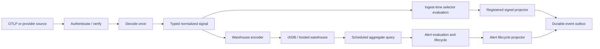

# Signal-to-event projection architecture

Related work: [issue #222](https://github.com/MapleTechLabs/maple/issues/222),
`@maple/alerting-core`

Audience: Maple maintainers and implementers of hosted or Maple Local runtimes

Implementers adding a source adapter or semantic projector should also read
[`eventing-extension-guide.md`](./eventing-extension-guide.md), which provides a
complete compile-time extension example, host wiring patterns, and review and
test checklists.

## Decision summary

Maple will treat immediate, per-occurrence event generation as an ingest concern,
not as a scheduled warehouse-query concern.

- Each accepted OTLP record or provider webhook is decoded and normalized into a
  typed signal once.
- An immutable snapshot of enabled signal projections is evaluated against that
  signal before its scalar types are flattened for warehouse storage.
- Every matching projection invokes a registered, pure projector that produces a
  factual [CloudEvents 1.0](https://github.com/cloudevents/spec/blob/main/cloudevents/spec.md)
  event.
- Produced events enter a durable, idempotent outbox. Consumers and delivery
  transports are downstream of that boundary.
- The original telemetry continues through the existing warehouse write path.
- chDB is not polled to discover newly arrived records. It remains the analytics
  store and an optional, explicitly invoked replay source.
- Scheduled aggregate alerts remain query-driven. Alert lifecycle transitions
  become another producer of typed events and use the same outbox as ingest-time
  projections.

The configurable matching model is a small, structured, typed predicate tree. It
is not arbitrary SQL and it is not a new textual expression language. The live
runtime evaluates the tree in memory. A warehouse adapter may lower the supported
subset to parameterized ClickHouse expressions for explicit historical replay,
but SQL behavior does not define the predicate semantics.

## Problem

Maple currently contains several mechanisms that are related but not expressed
through one event boundary:

- hosted alert rules periodically query telemetry, update incident lifecycle
  state, and request deliveries;
- PlanetScale receives signed webhooks and performs provider-specific work;
- Maple Local accepts OTLP records and writes them directly to chDB;
- future automation needs individual facts, such as a source record being
  observed, to become events that agents or other consumers can act on.

Using the alert scheduler for the last case would give it the wrong semantics.
A windowed query answers a question about a set of stored records and normally
produces one aggregate observation. It cannot faithfully represent every
individual occurrence without cursors, overlap windows, late-arrival handling,
and deduplication.

The current Local `logs` table has no ingestion sequence or native event ID. Its
sort key is designed for observability queries, and arbitrary OTLP attributes are
stored as strings. Repeatedly querying that table once per rule would therefore:

- compete with ingest, UI queries, checkpoints, retention, and archive work;
- miss late records or repeatedly rediscover records unless a second deduplication
  system is added;
- require casts that cannot always recover the source value's original type;
- turn an embedded analytical database into an inefficient message queue.

The event layer is still useful. It belongs in front of chDB for live signals,
with chDB retained behind it for analytics and aggregate alert evaluation.

## Goals

1. Allow operators and integrations to configure which incoming signals become
   typed events without writing SQL or changing core runtime code.
2. Evaluate each delivered signal in one ingest pass against all applicable
   projections; do not issue one warehouse query per projection.
3. Preserve scalar types for string, boolean, integer, floating-point,
   timestamp, and duration comparisons.
4. Make source adapters, projectors, event persistence, and consumers replaceable
   behind explicit interfaces.
5. Give emitted events stable identities so retries do not create duplicate
   logical events when the source provides stable occurrence identity.
6. Reuse the same event envelope and outbox for query-alert lifecycle events.
7. Keep Maple Local headless: matching and event persistence must work while no
   browser is open.
8. Keep the core deterministic, bounded, tenant-scoped, and independent of a
   database, network, scheduler, wall clock, or particular deployment host.

## Non-goals

- Adding NATS, JetStream, Kafka, or another general-purpose broker as a required
  Maple component.
- Loading arbitrary third-party code into a running Maple process. A "plugin" in
  this document is a compile-time registered module behind a stable interface.
- Defining sink delivery, consumer-specific behavior, agent authorization, or
  action policy.
- Replacing the Collector's routing, filtering, queueing, or authentication.
- Replacing scheduled queries for rates, percentiles, absence, threshold state,
  or other aggregate alerts.
- Guaranteeing exactly-once external side effects across an uncooperative source,
  Maple, and an arbitrary consumer.
- Automatically replaying old telemetry whenever a projection is created or
  changed.
- Providing a general scripting language, joins, aggregation, arithmetic,
  regular expressions, or user-provided SQL in the first version.

## Terminology

**Signal**
: One factual input occurrence after authentication, decoding, and normalization.
It may originate as an OTLP log/span/metric point or a provider webhook.

**Source adapter**
: A module that verifies or accepts a source payload, normalizes occurrences into
typed signals, declares known fields, and supplies source identity when
available.

**Signal projection**
: Durable configuration pairing a source kind, typed selector, and registered
projector. It says which source occurrences should be promoted into which
event representation. It is distinct from a downstream event subscription.

**Selector**
: A bounded structured predicate over typed signal fields.

**Projector**
: A pure, versioned function that maps one matching signal to a declared event
type and data schema. Provider-specific meaning belongs here rather than in the
eventing core.

**Event**
: An immutable CloudEvents 1.0 envelope containing a typed factual payload.

**Event outbox**
: Durable host storage that makes event creation idempotent and separates event
production from downstream delivery.

**Event consumer**
: A downstream component interested in one or more event types. Webhooks,
automation workers, agents, and provider responses are consumer concerns, not
selector or projector concerns.

## Architecture

There are two intentionally different event-production paths. They converge only
after a factual event has been produced.



The upper path handles occurrences such as "this source record was observed". The
lower path handles conclusions such as "the error rate has remained above five
percent for ten minutes". Both can ultimately notify the same consumers without
pretending they have the same input or timing semantics.

### Required module boundaries

The architecture has four replaceable boundaries:

1. **Source adapters** turn authenticated source payloads into typed signals.
2. **Selectors** determine whether a normalized signal qualifies.
3. **Projectors** map a qualifying signal to a typed factual event.
4. **Consumers** subscribe to event types downstream of the durable outbox.

The eventing core owns the contracts and deterministic behavior. It does not know
about particular providers, consumers, databases, queues, or network transports.

PlanetScale is therefore one installed composition, not the model itself. Its
module can register a webhook source adapter and PlanetScale-specific projectors.
Those projectors can be replaced or supplemented without changing the selector
evaluator or downstream event contract. Existing PlanetScale behavior can later
be moved behind consumers of those typed events without putting provider actions
inside the projector.

## Core data contracts

The TypeScript below is illustrative. Canonical persisted encodings must be
defined with runtime schemas and shared conformance fixtures.

### Typed values

```ts
type SignalScalar =
	| { readonly type: "string"; readonly value: string }
	| { readonly type: "boolean"; readonly value: boolean }
	| { readonly type: "int64"; readonly value: string }
	| { readonly type: "float64"; readonly value: number }
	| { readonly type: "timestamp"; readonly value: string }
	| { readonly type: "duration"; readonly value: string }
```

`int64` and `duration` use decimal strings in serialized form so JavaScript does
not lose precision. Runtime evaluators may compile them to native `bigint` or the
equivalent host type. Timestamp values use canonical RFC 3339 with an explicit
offset in serialized form and compare as UTC instants. Duration values represent
integer nanoseconds. `float64` values must be finite; `NaN` and infinities are
rejected during normalization.

Arrays and objects may be preserved for projector payloads, but selectors operate
only on declared scalar fields in version 1.

### Normalized signal

```ts
interface NormalizedSignal {
	readonly sourceKind: string
	readonly source: string
	readonly tenantId: string
	readonly occurrenceId: string | null
	readonly identityQuality: "source" | "derived" | "none"
	readonly occurredAt: string
	readonly observedAt: string
	readonly subject: string | null
	readonly fields: ReadonlyMap<string, SignalScalar>
	readonly data: unknown
}
```

- `sourceKind` chooses the compatible field catalog and projector registry.
- `source` is a stable URI identifying the logical producer or integration.
- `occurrenceId` is a source-issued stable identifier when one exists.
- `identityQuality: "source"` means the adapter expects the ID to survive source
  retries and rebatching. `"derived"` identifies a canonical content fingerprint
  with documented collision/collapse limitations. `"none"` cannot support a
  durable once-only automation guarantee.
- `occurredAt` is source event time; `observedAt` is the stable source-observation
  time when the source provides one. Maple acceptance time is host control
  metadata passed separately to activation gating, so retries cannot leak a new
  receipt timestamp into projector output.
- `fields` contains canonical built-ins and namespaced source attributes. It must
  not contain secrets merely because they were present in the incoming payload.
- `data` is a bounded, schema-validated, source-specific representation available
  to compatible projectors. It may contain arrays and objects that are not
  selector-addressable, but it follows the adapter's redaction policy and is not
  an unvalidated raw request body.

The source adapter must not expose an unbounded raw payload as the selector field
space or projector input.

### Field references and catalogs

A selector uses logical field references, never physical column names:

```ts
interface FieldRef {
	readonly namespace: "signal" | "resource" | "scope" | "attribute" | "body"
	readonly key: string
	readonly type: SignalScalar["type"]
}
```

Each source adapter exposes a field catalog for known fields. A catalog entry
declares:

- logical name and one or more scalar types;
- allowed selector operators;
- sensitivity and whether a projector may expose it by default;
- whether historical replay is `exact`, `coerced`, or `unavailable`;
- an optional backend-owned replay binding. This binding is not user SQL.

OTLP resource, scope, and record attributes are open-ended. A projection may
reference an uncatalogued attribute by explicitly declaring its expected scalar
type. At runtime a differently typed value does not get coerced; it does not
match, and a bounded type-mismatch metric is recorded. Source-specific modules
should publish catalogs for common attributes so users do not need to repeat
those declarations. OTLP log bodies are deliberately closed in version 1: only
the polymorphic `body:value` field is selectable, and only when the entire body
is a scalar. Structured body objects and arrays remain available to projectors
through normalized signal data but do not advertise child selector fields that
the adapter cannot populate.

### Selector AST

```ts
type SignalPredicate =
	| { readonly op: "all"; readonly clauses: readonly SignalPredicate[] }
	| { readonly op: "any"; readonly clauses: readonly SignalPredicate[] }
	| { readonly op: "not"; readonly clause: SignalPredicate }
	| { readonly op: "exists"; readonly field: FieldRef }
	| {
			readonly op: "eq" | "neq" | "gt" | "gte" | "lt" | "lte" | "contains"
			readonly field: FieldRef
			readonly value: SignalLiteral
	  }
	| {
			readonly op: "in"
			readonly field: FieldRef
			readonly values: readonly SignalLiteral[]
	  }
```

Version 1 has the following semantics:

| Operation                | Supported types                             | Semantics                                                                 |
| ------------------------ | ------------------------------------------- | ------------------------------------------------------------------------- |
| `exists`                 | all                                         | True only when the field is present with a valid typed scalar.            |
| `eq`, `neq`              | all                                         | Exact same-type comparison. A missing or mistyped field makes both false. |
| `gt`, `gte`, `lt`, `lte` | `int64`, `float64`, `timestamp`, `duration` | Ordered same-type comparison.                                             |
| `contains`               | `string`                                    | Case-sensitive Unicode substring comparison.                              |
| `in`                     | all                                         | Exact same-type membership; all literals must share the field type.       |
| `all`, `any`, `not`      | predicates                                  | Total boolean composition with short-circuit evaluation.                  |

There are no implicit casts. The string `"3"` is not the integer `3`; an integer
is not silently promoted to a float; and a string that resembles a date is not a
timestamp. Adapters may deliberately normalize a provider value into a declared
type, but that conversion is part of the source contract and is tested there.

Missing values are not equivalent to null. Null source values are treated as
missing in version 1. Consequently `neq` requires a present field, whereas
`not(eq(...))` also matches a missing field. Configuration tooling should prefer
the explicit form that expresses the intended behavior.

Validation happens before a projection can become active. Version 1 limits a
selector to:

- nesting depth of 8;
- 64 total predicate nodes;
- 100 members in one `in` predicate;
- 1,024 Unicode code points per string literal (at most 4 KiB UTF-8);
- no regular expressions, functions, arithmetic, joins, or user code.

These bounds keep evaluation predictable and leave room for indexing active
projections by source kind and simple discriminating fields. `SignalScalar`
describes normalized source data and does not inherit the literal-only 1,024-code-point
limit; the OTLP adapter accepts source strings up to its separate 16 KiB bound.
The literal limit is normative in UTF-8 bytes. Because JSON Schema `maxLength`
counts characters rather than encoded bytes, the generated schema documents the
constraint and the shared multibyte conformance vectors enforce its exact edge.

### Signal projection

```ts
interface SignalProjectionSpec {
	readonly id: string
	readonly revision: number
	readonly enabled: boolean
	readonly tenantId: string
	readonly sourceKind: string
	readonly selector: SignalPredicate
	readonly projector: {
		readonly id: string
		readonly version: number
		readonly config: unknown
	}
	readonly activeFrom: string
}
```

Every semantic edit creates a new immutable revision. Activation is not
retroactive: the new revision sees signals accepted after the runtime atomically
installs its compiled registry snapshot. Historical processing requires an
explicit replay operation.

Replaying the exact latest revision is a no-op only while its enabled/disabled
state still matches the active pointer. Replaying an older revision is a stale
revision conflict; an intentional rollback is a new monotonic revision that
copies the earlier configuration.

The configuration record is data. Source adapters and projector implementations
are registered code. This is how matching remains configurable without making
authentication, provider semantics, or executable code user-supplied.

For example, an installed source adapter and projector can use this neutral
contract:

```json
{
	"id": "example-record-observed",
	"revision": 1,
	"enabled": true,
	"tenantId": "local",
	"sourceKind": "otel.log",
	"selector": {
		"op": "all",
		"clauses": [
			{
				"op": "eq",
				"field": { "namespace": "signal", "key": "event.name", "type": "string" },
				"value": { "type": "string", "value": "example.record.observed" }
			},
			{
				"op": "gte",
				"field": { "namespace": "attribute", "key": "record.sequence", "type": "int64" },
				"value": { "type": "int64", "value": "1" }
			}
		]
	},
	"projector": { "id": "example.record", "version": 1, "config": {} },
	"activeFrom": "2026-08-07T00:00:00Z"
}
```

The `gte` comparison above is an integer comparison, not lexicographic string
ordering. A timestamp predicate would similarly carry a `timestamp` literal and
compare normalized instants rather than formatted text. No query is generated
for either comparison on the live path.

### Projector contract

```ts
interface SignalProjector {
	readonly id: string
	readonly version: number
	readonly sourceKinds: readonly string[]
	readonly outputType: string
	readonly dataSchema: string
	readonly decodeConfig: (value: unknown) => ProjectorConfig
	readonly decodeOutput: (value: unknown) => JsonValue
	readonly project: (signal: NormalizedSignal, config: ProjectorConfig) => ProjectedEventData
}
```

A projector must be pure, deterministic, bounded, versioned, and free of I/O. It
does not invoke downstream systems, send notifications, or mutate source state.
It produces a factual event payload conforming to its declared schema. The
registry invokes the output decoder before constructing the CloudEvent, so
`dataschema` is a checked contract rather than documentation.

The registry may include a bounded generic field-mapping projector for
operator-defined factual events. Provider modules register semantic projectors
when field copying is insufficient. No runtime module loading is required.

### Event envelope

Produced events use CloudEvents 1.0 structured representation:

```json
{
	"specversion": "1.0",
	"id": "sha256:...",
	"source": "urn:maple:source:otel:local",
	"type": "dev.maple.example.record.observed.v1",
	"subject": "records/42",
	"time": "2026-08-07T19:42:00.000000000Z",
	"datacontenttype": "application/json",
	"dataschema": "urn:maple:event-schema:example-record:v1",
	"tenantid": "...",
	"projectionid": "...",
	"projectionrevision": 3,
	"data": {}
}
```

Names above are illustrative until the repository reserves its canonical event
type and schema namespace.

The event ID is deterministic when stable occurrence identity exists:

```text
sha256:<hex SHA-256 of length-delimited fields>
```

The fields, in order, are `maple-event-v1`, tenant ID, source kind, source URI,
occurrence ID, projection ID, and the decimal projection revision. Encode each
field as UTF-8, prefix it with its byte length as an unsigned four-byte big-endian
integer, concatenate, and hash. The `sha256:` prefix is outside the hash.

The hash input uses a canonical length-delimited encoding, not string
concatenation. Projector version and output schema version are already fixed by
the immutable projection revision and must be recorded with the event.

Sensitive source details belong in `data`, under the projector's explicit schema
and redaction policy. They must not be copied into CloudEvents context attributes,
logs, metrics labels, or idempotency keys.

## Runtime behavior

### Projection compilation and activation

The host loads enabled projections for a tenant, validates them against the
source and projector registries, and compiles them into immutable predicate
functions. The active registry is swapped atomically. Every decoded ingest batch
uses exactly one registry snapshot, even if configuration changes while the batch
is being processed.

The initial implementation may evaluate all projections in the applicable
`sourceKind` bucket. The registry may later index projections by exact-match
discriminators such as event name or service name. This is an optimization and
must not alter selector semantics or ordering.

Projection evaluation is deterministic and side-effect free. All matching
projections run; this is not first-match routing. A signal may therefore produce
zero, one, or several different factual events.

### Maple Local OTLP ingest

Maple Local already decodes an OTLP request and then passes the decoded payload
to the warehouse encoder. The event seam belongs between those operations.

The implementation should refactor decoding/normalization so that:

1. the OTLP request is parsed once;
2. typed record values remain available to the matcher;
3. the existing warehouse rows are produced without changing their stored shape;
4. matched events are staged idempotently before ingest acknowledges success;
5. the telemetry insert completes;
6. staged events are marked ready for downstream consumption;
7. only then is the OTLP request acknowledged.

When no projection matches, the path adds only bounded predicate work before the
existing chDB insert.

If the event store cannot stage a required event, ingest returns a retryable
failure rather than silently losing automation. A source retry reuses the same
event ID and canonical event bytes, so staging is idempotent. Durable OTLP log
projection requires `timeUnixNano` or `observedTimeUnixNano`; server receipt
time is never incorporated into durable identity or event content.
OTLP permits both timestamp fields to be absent or zero; those records remain
accepted by the warehouse path but are skipped by durable event projection.
The same isolation applies to eventing-specific normalization bounds: an
oversized attribute map or nested value makes only that source occurrence
ineligible for projection and records a bounded normalization failure. The
existing warehouse encoder still decides independently whether the OTLP record
is valid for storage, so enabling a projection does not narrow ingest. Before
full event normalization, Maple performs a tolerant, bounded extraction of the
stable source URI and source-issued occurrence ID. An ineligible occurrence
that matches an existing staged obligation fails ingest rather than silently
acknowledging a changed retry and stranding the earlier event.

Staging and chDB insertion are not one transaction. A process crash after the
chDB insert but before the OTLP acknowledgement can still cause a duplicate raw
telemetry row on retry; that is already possible with at-least-once OTLP
delivery. The staged/ready outbox protocol prevents an event from becoming
dispatchable before the ingest attempt reaches its warehouse commit point.
Staged rows retain the source occurrence identity and original projection
revision plus a bounded hash of the normalized source content. On redelivery,
Maple recovers those exact event IDs and does not reevaluate that occurrence
against a newer or disabled projection snapshot. Recovery requires the source
hash to match; reuse of the same source identity with changed content fails as a
collision and leaves the staged event non-ready. Within one ingest batch, two
records that reuse the same tenant, source kind, source URI, and source-issued
occurrence ID must also have the same normalized source hash. Maple checks that
source tuple for every normalized occurrence before selectors divide it into
zero, one, or several projected event IDs. A projection-ineligible record that
reuses a normalized tuple makes the batch ambiguous and is rejected before any
event is staged. The fingerprint contract orders field keys by explicit
JavaScript code-unit order, not locale collation, so checkpoint recovery is
independent of host locale.

Schema 4 introduced this source fingerprint. Opening a schema-3 control store
therefore fails before migration if it contains staged source-backed rows whose
fingerprints cannot be reconstructed. Ready rows and stores without unresolved
source-backed staging remain eligible for migration. Restore copies a signed
control snapshot into a private scratch store, opens and migrates that copy, and
serializes the validated current-schema database into the restored data
directory. An unsafe legacy snapshot therefore fails before restore readiness
or the live-directory swap; the signed checkpoint artifact itself is unchanged.

If atomic exactly-once storage across both systems later becomes a requirement,
the correct addition is a durable ingress journal before both writes. chDB
polling does not solve that problem.

### Provider webhooks

Provider authentication and replay protection run before normalization. The
host must establish a durable event boundary before acknowledging the provider.
The hosted PlanetScale route therefore requires the provider timestamp,
projects a verified payload first, and enqueues only the resulting canonical
CloudEvent plus bounded routing metadata; the queue is its durable event
boundary. The complete serialized job is measured against a 120 KiB cap before
send; oversized factual payloads receive a deterministic `413` rather than a
retryable queue failure. Consumers continue to read legacy payload-only and
transitional jobs.

Current queue jobs are decoded as one relational contract: the event tenant,
source, embedded connection, type, schema, and timestamp must agree with the
bounded routing fields. Unsupported or contradictory jobs are terminally
acknowledged as poison messages. Health-event issue mutations use a durable
`(org_id, event_id)` receipt inserted in the same PostgreSQL transaction as the
issue mutation; timeline insertion remains independently idempotent. A retry
after a failure between those phases therefore completes the issue once without
duplicating its occurrence count or history. Transactions also take a scoped
lock for `(org_id, issue fingerprint)` before claiming the receipt. Concurrent,
distinct events for the same issue are therefore all counted, while only one
transition reopens a resolved issue.

The provider source adapter supplies the strongest available delivery or event
identity. It then uses the same selector, projector, event ID, and outbox
contracts as OTLP. Provider-specific response behavior does not live in the core;
it can be migrated behind consumers of the emitted event types.

### Query-driven alerts

Scheduled alert rules retain their existing execution model:

1. the host schedules and claims a rule;
2. a warehouse query produces an aggregate `AlertObservation`;
3. `@maple/alerting-core` evaluates threshold and lifecycle state;
4. an alert lifecycle projector converts `trigger`, `resolve`, `renotify`, or
   `test` intent into a CloudEvent;
5. the host persists it through the common event outbox.

This path queries chDB or the hosted warehouse because its input is an aggregate
over time. It does not reuse the ingest-time signal selector, and the ingest-time
path does not impersonate an alert incident.

### Historical replay

Replay is an operator-invoked batch operation, never the live event mechanism.
It evaluates one projection revision over a bounded time range and must support a
dry-run count/sample mode before it can persist events.

Every field catalog entry declares replay capability:

- `exact`: stored data retains enough type and identity information to reproduce
  live semantics;
- `coerced`: the adapter can apply an explicit cast, but the source type was lost
  or identity is derived;
- `unavailable`: the backend cannot implement the live predicate faithfully.

A replay request using a `coerced` field requires explicit operator
acknowledgement. A request using an unavailable field is rejected. The warehouse
compiler emits parameterized expressions through existing query-building
facilities; it never interpolates field names or literals supplied directly by a
user.

Current Local OTLP attribute maps store strings, so arbitrary typed attributes
will generally be `coerced`, not `exact`. Replay event IDs are guaranteed to
deduplicate against live events only when the warehouse retained the same stable
source occurrence ID.

## Processing and delivery guarantees

The architecture uses precise, layered guarantees rather than the blanket phrase
"exactly once".

| Boundary                               | Guarantee                                                                                                      |
| -------------------------------------- | -------------------------------------------------------------------------------------------------------------- |
| Source to Maple                        | At least once when the source/Collector retries; source-specific otherwise.                                    |
| One accepted batch                     | One evaluation against one immutable projection-registry snapshot.                                             |
| Projection with source-stable identity | Effectively-once event creation through deterministic ID plus unique outbox insertion.                         |
| Projection with derived identity       | Best-effort deduplication; identical real occurrences may collapse and re-encoded retries may diverge.         |
| Projection with no identity            | At-least-once event creation only; durable automation should reject this configuration by default.             |
| Outbox to consumer                     | At least once with an event ID/idempotency key; consumer-side external effects are outside this specification. |
| chDB telemetry row                     | Existing OTLP semantics; duplicate storage remains possible after ambiguous failures.                          |

A projection intended to trigger external automation must require
`identityQuality: "source"` unless an operator explicitly accepts weaker
semantics. An installed source adapter should therefore furnish a stable event
or delivery identifier as part of its source contract.

## chDB responsibilities

chDB is responsible for:

- storing telemetry for interactive and analytical queries;
- serving scheduled aggregate-alert queries;
- serving bounded explicit replay where field capabilities allow it;
- participating in existing checkpoint, retention, and archive workflows.

chDB is not responsible for:

- acting as a live queue;
- maintaining one cursor per signal projection;
- deduplicating event delivery;
- storing mutable projection configuration or delivery attempts merely because
  it stores the source telemetry;
- defining selector type semantics through ClickHouse casts.

Version 1 requires no new column or sort-key change to the existing telemetry
tables. A future narrow event journal or ingress-identity column may improve
replay, but it must be justified separately and must not turn wide raw-telemetry
tables into queue state.

## Alternatives considered

| Alternative                                      | Decision                                                                                                                                                                                                                                        |
| ------------------------------------------------ | ----------------------------------------------------------------------------------------------------------------------------------------------------------------------------------------------------------------------------------------------- |
| One periodic chDB query per projection           | Rejected. It repeats wide scans, introduces cursor/late-arrival problems, and competes with the analytical workload.                                                                                                                            |
| One shared query that tails all recent chDB rows | Rejected as the live path. It reduces query count but still lacks a reliable ingestion cursor and evaluates after scalar type loss. It may inform an explicit replay implementation.                                                            |
| ClickHouse materialized views per projection     | Rejected. Mutable user configuration would become DDL, current attribute storage has already flattened types, and lifecycle/deduplication state still needs another store.                                                                      |
| Collector OTTL as Maple's rule language          | Kept as an optional deployment optimization. It is valuable for OTel-only routing but does not define provider-webhook behavior or Maple-managed dynamic configuration.                                                                         |
| CEL as the first expression language             | Deferred. CEL is safe and capable, but embedding compatible runtimes and defining warehouse lowering is more surface than the initial predicates require. Reconsider it if the bounded AST is demonstrably insufficient.                        |
| CloudEvents SQL as the signal selector           | Rejected for raw signals. [CESQL 1.0](https://github.com/cloudevents/spec/blob/main/cesql/spec.md) filters CloudEvent context attributes but does not address arbitrary event `data`; it may be useful for downstream CloudEvent subscriptions. |
| NATS or another broker as the event abstraction  | Rejected as a requirement. A broker can later implement an event transport port, but it does not replace source normalization, selector semantics, projectors, identity, or host persistence.                                                   |
| A custom textual DSL                             | Rejected. The structured predicate tree is the persisted intermediate representation; configuration UIs and APIs do not need a parser.                                                                                                          |

## Durable host ports

The core needs interfaces rather than a prescribed database:

```ts
interface SignalProjectionStore {
	loadEnabled(tenantId: string): Promise<readonly SignalProjectionSpec[]>
}

interface EventOutboxStore {
	stage(events: readonly CloudEvent[]): Promise<StageResult>
	markReady(eventIds: readonly string[]): Promise<void>
}
```

The real contracts also need revision/change notification, unique event IDs,
bounded batch operations, health inspection, and recovery of staged records.

Hosted Maple may implement these ports with its relational state and queue
infrastructure. Maple Local needs a small transactional control-state store whose
rules, outbox, and migration identity survive restart. That state is not covered
by chDB checkpoints automatically; backup, restore, and schema migration are part
of the Local host adapter's acceptance criteria.

The physical Local store is an implementation decision, but it must provide:

- uniqueness on event ID;
- atomic projection revision writes;
- atomic event staging and readiness transitions;
- bounded recovery of stranded staged events;
- crash-safe migrations and explicit backup/restore behavior;
- no dependency on a browser process.

## Package and host ownership

The intended ownership is:

- `packages/eventing-core` (new): language-neutral schemas, selector validation,
  the reference TypeScript evaluator, projector registry contracts, canonical
  event identity, and conformance fixtures. No database, network, scheduler, or
  global clock dependencies.
- `packages/alerting-core` (new): aggregate alert evaluation and incident
  lifecycle. It remains distinct and later emits through an eventing-core port.
- `packages/domain`: public/API schemas when projection CRUD becomes public.
- `apps/cli`: Maple Local OTLP source adapter, compiled-registry lifecycle,
  durable Local ports, ingest staging, and optional replay adapter.
- `apps/api`: provider webhook adapters and hosted persistence wiring.
- `apps/ingest`: a future Rust OTLP adapter only when hosted per-signal projection
  is required.

The canonical JSON schemas and fixture corpus, rather than TypeScript source
types, define cross-language behavior. A Rust implementation must pass the same
valid/invalid selector cases, typed comparison cases, canonical event-ID vectors,
and projection fixtures before it can claim compatibility.

[OpenTelemetry Transformation Language](https://github.com/open-telemetry/opentelemetry-collector-contrib/tree/main/pkg/ottl)
can remain a Collector-side optimization or adapter. It is not the universal
Maple contract because it is coupled to OTel Collector contexts and does not
cover provider webhooks. [CEL](https://cel.dev/overview/cel-overview) is the
preferred language to reconsider if real requirements outgrow the bounded AST;
version 1 does not embed CEL runtimes or define a CEL-to-ClickHouse compiler.

## Security and tenancy

- Authentication or provider signature verification occurs before a source
  adapter may produce a signal.
- Every signal, projection, event, and outbox operation carries an explicit
  tenant ID. Cross-tenant registry lookup or event fanout is forbidden.
- User configuration cannot name SQL columns, inject SQL fragments, load code,
  call functions, or select secrets outside the source field catalog.
- Source adapters mark sensitive fields. Generic projectors exclude them by
  default; provider projectors must opt in deliberately and document why.
- Projected event size and source-field size are bounded before outbox insertion.
- Runtime errors and telemetry must not record full sensitive payloads.
- Sink URL validation, private-network policy, signing, and agent authorization
  remain downstream policies. General eventing must not weaken hosted SSRF
  protections.

## Failure handling and observability

Malformed projection configuration is rejected before activation. The reference
evaluator is total: missing fields and runtime type mismatches produce defined
non-matches rather than exceptions.

A projector must return either schema-valid event data or a bounded typed
projection failure. A bad occurrence must not create an infinite source retry
loop. The host records the failure against projection ID/revision and occurrence
identity, exposes degraded health, and quarantines or dead-letters according to a
bounded policy. Exact quarantine policy belongs to the host adapter, but silently
dismissing a durable projection failure is not allowed.

Required low-cardinality telemetry includes:

- received signals by source kind;
- selector evaluations and matches by projection ID;
- bounded selector type-mismatch counts by source kind, without arbitrary open
  field names as metric labels;
- projection failures;
- outbox staged, deduplicated, ready, and stranded counts;
- evaluation and staging latency;
- active projection count and registry revision;
- replay scanned, matched, emitted, and deduplicated counts.

Raw field values, subjects, event IDs, and arbitrary event types must not become
unbounded metric labels.

Maple Local implements the ingest-time subset as
`maple.eventing.operations_total`, `maple.eventing.operation_duration_ms`, and
`maple.eventing.consumer_lag_events`. Their only attributes are bounded
`operation`, `outcome`, and `source_kind` values. The operations cover
normalization, projection success/failure, outbox stage/ready/deduplication, and
consumer claim/ack/lease/lag. Tenant IDs, projection and consumer IDs, event
types and IDs, URLs, payload fields, lease tokens, and credentials are never
metric attributes. Replay and stranded-outbox telemetry remain applicable only
when those optional host operations run.

## Compatibility and migration

This design extends rather than replaces the host-neutral alert-core extraction
already on the issue-222 branch.

1. Existing hosted aggregate alerts continue using their scheduler, query,
   lifecycle, and delivery behavior while the event contract is introduced.
2. The new eventing core lands without runtime activation and with conformance
   fixtures.
3. Maple Local adds ingest-time projection behind an explicit feature/config
   gate. With no active projections, observable ingest and chDB behavior remain
   unchanged.
4. A neutral OTLP record fixture proves the end-to-end source identity, typed
   selector, projector, retry deduplication, and durable outbox path.
5. PlanetScale is adapted behind the same source/projector interfaces while its
   existing externally visible behavior remains intact. A compare/dual-observe
   period should precede removal of direct hard-coded handling.
6. Alert lifecycle intents are projected into the same CloudEvents/outbox model
   after parity tests show no change to trigger, resolve, renotify, test,
   suppression, or retry semantics.
7. Warehouse replay is added only after the live path is proven and replay
   capability metadata is implemented.

No migration step requires NATS, a per-rule chDB cursor, or a new raw-telemetry
sort key.

## Implementation slices for the next goal

### Slice 1 — Contract and evaluator

- Add `packages/eventing-core`.
- Define runtime schemas for typed values, fields, predicates, projection specs,
  projector registrations, and CloudEvent output.
- Implement validation, compilation, and the pure reference evaluator.
- Add canonical JSON and event-ID test vectors.
- Add complexity-limit and hostile-input tests.

### Slice 2 — Local durable control state

- Select and document the Local transactional store.
- Implement projection revision and outbox ports, migrations, recovery, and
  backup/restore hooks.
- Expose headless health inspection before UI work.

### Slice 3 — Local ingest seam

- Refactor OTLP normalization to preserve typed values without decoding twice.
- Load and atomically swap compiled projection snapshots.
- Stage matching events, insert telemetry, mark events ready, and acknowledge.
- Prove that the live path executes no chDB `SELECT` and adds no scheduler.

### Slice 4 — Example extension: source record to durable Maple event

- Define a source adapter's OTLP field contract and stable occurrence identity.
- Register its field catalog and a pure semantic projector outside the core.
- Configure a record-observed projection without hard-coded selector values in
  the evaluator.
- Verify duplicate source deliveries create one logical outbox event.

This slice stops at the outbox. Transport and agent-action behavior are
downstream concerns using the produced typed event.

### Slice 5 — Existing producer convergence

- Adapt PlanetScale webhook inputs to the source/projector contracts.
- Project alert lifecycle intents into CloudEvents.
- Preserve existing provider and alert behavior with parity fixtures before
  switching consumers.

### Slice 6 — Optional replay

- Add per-field replay capability declarations.
- Implement bounded dry-run and explicit emission modes.
- Add evaluator-versus-ClickHouse conformance tests for every `exact` binding.

## Acceptance criteria

The first usable implementation is complete when all of the following are true:

1. A configured OTLP record signal is matched before chDB encoding and produces
   a schema-valid CloudEvent while the telemetry record is still stored normally.
2. Re-delivery of a source-stable occurrence produces the same event ID and one
   logical outbox record.
3. A nonmatching signal performs no warehouse read and creates no event.
4. Several active projections are evaluated from one registry snapshot, and all
   matches run.
5. Integer, float, timestamp, duration, boolean, and string truth-table fixtures
   pass with no implicit coercion.
6. Projection changes are validated, revisioned, persisted, and activated
   atomically without restarting Maple Local.
7. Rules and ready/staged outbox records survive process restart and participate
   in documented backup and recovery.
8. chDB query alerts retain their existing aggregate and lifecycle behavior.
9. No implementation requires a browser, a new broker, arbitrary runtime code,
   raw SQL configuration, or a per-projection chDB poller.
10. The event envelope and selector fixture corpus are sufficient for a second
    language implementation to demonstrate semantic parity.

## Settled implementation choices

The TypeScript reference implementation settles the remaining host choices as
follows:

- Maple Local stores projection revisions, failures, and the staged/ready outbox
  in SQLite at `<dataDir>/control/eventing.sqlite`, using WAL and `synchronous =
FULL`. While ingest is quiesced, backup first completes and verifies a blocking
  `wal_checkpoint(TRUNCATE)` so the serialized database contains every committed
  control-store transaction rather than only the main SQLite file. A version-2
  Maple checkpoint contains `control.sqlite` beside the chDB
  backup and binds its byte count, SHA-256 digest, schema version, and row counts
  in the checkpoint manifest. Version-1 checkpoints remain readable and restore
  an empty control store.
- The reference OTLP extension example uses a LogRecord event name such as
  `example.record.observed`. An installed adapter defines its own accepted stable
  occurrence identifiers, field catalog, validation rules, and semantic
  projector. The eventing core neither synthesizes provider fields nor assigns
  provider meaning to arbitrary attributes.
- Maple-owned event types use `dev.maple.*.v1`; schemas use
  `urn:maple:event-schema:*:v1`. Installed projectors reserve their concrete
  event type and schema names; neutral fixtures use
  `dev.maple.example.record.observed.v1` with
  `urn:maple:event-schema:example-record:v1`.
- Attribute strings are limited to 16 KiB, source/event identities to 256
  characters (long stable inputs are represented by a SHA-256 URN), each
  attribute namespace to 256 entries,
  nested values to depth 8 and 1,024 nodes, normalized source data to 256 KiB,
  and a canonical outbox CloudEvent to 256 KiB. Secret-like attribute names are
  excluded from the projection field and data views.
- The Local TypeScript path is the reference live implementation. Hosted Rust
  ingest remains a later adapter and must pass the shared schemas and fixture
  corpus before claiming parity.
- Verified non-test PlanetScale webhooks run through a registered
  `planetscale.webhook` source adapter, selector, and projector before the route
  acknowledges them. The dedicated Cloudflare Queue durably carries
  `dev.maple.planetscale.webhook.received.v1` without duplicating the provider
  payload. Queue consumers accept the event-only message plus transitional and
  exact pre-migration shapes, reconstructing the deterministic event from older
  timestamped messages during rolling upgrades. Timestamp-less legacy jobs are
  terminally acknowledged without durable projection.
- Hosted query-alert delivery rows remain that producer's durable outbox. Their
  payload now includes an additive deterministic
  `dev.maple.alert.lifecycle.{trigger,resolve,renotify,test}.v1` CloudEvent while
  retaining every legacy top-level delivery field. Retry creation preserves the
  originally stored JSON, including the CloudEvent ID and future additive fields,
  instead of round-tripping it through a lossy legacy schema.
- Historical replay execution remains deliberately unimplemented in this
  change. Field catalogs already declare `exact`, `coerced`, or `unavailable`,
  but Local's current arbitrary attribute maps have lost source scalar type and
  its warehouse rows do not furnish a native occurrence ID. A later bounded,
  operator-invoked replay adapter must require explicit coercion acknowledgement
  and pass live-evaluator conformance tests; the live path never falls back to a
  chDB poller in the meantime.
- Projector failures with a source occurrence ID are idempotent per projection
  revision. Local retains a bounded newest 10,000 failure rows per tenant and
  exposes the count through the authenticated headless health endpoint. A
  projector failure does not retry a valid telemetry occurrence forever;
  infrastructure failure to persist required state remains retryable.

Maple Local activates immutable revisions with authenticated
`POST /local/eventing/projections`. The same maintenance credential protects
`GET /local/eventing/projections`, `/local/eventing/health`,
`/local/eventing/outbox`, and consumer administration. Ready records receive a separate, append-only
readiness `sequence` on their first staged-to-ready transition;
`?after=<sequence>&limit=<n>` therefore cannot skip an older staged event that is
recovered after newer events were already read. `?state=staged` uses the original
staging sequence for bounded inspection of records stranded before the chDB
commit point. The Local store defaults to at most 10,000 events and 256 MiB of
canonical event JSON. When either cap would be exceeded, new projections are dropped while warehouse ingestion continues. A durable delivery gap blocks subsequent consumer claims until an operator accepts its generation. Existing records remain intact; the maintenance-only abandon API can explicitly remove stranded records. Inspection remains non-destructive. Named downstream
consumers use the separate [Maple Local event consumer protocol](./local-event-consumers.md) for
leased, at-least-once claims and exact whole-batch acknowledgement. Ready-event pruning advances only
through the slowest active consumer and retains a bounded acknowledged tail; staged events are never
pruned by delivery acknowledgement.

Re-delivery is the safe recovery operation: it locates staged rows by stable
source occurrence, preserves their original projection snapshot, and promotes
those exact event IDs only after the warehouse write succeeds. Maple never blindly
promotes an old staged record because, after a crash, the control store alone
cannot prove whether the corresponding chDB write committed. Activation requires
authentication, a bounded request body, structural budget validation, and full
registry compilation before acquiring global quiescence. Only the projection
revision commit and immutable runtime-registry swap occur while ingest is
quiesced, so invalid credentials, incomplete bodies, and expensive validation do
not close admission and every ingest request still observes exactly one registry
version. Concurrent maintenance requests receive an intentional conflict response.

## Compatibility and delivery notes

The initial Local adapter projects OTLP logs only; traces and metrics continue through ordinary warehouse ingestion. Alert webhook and Hazel payloads gain an additive `event` CloudEvent envelope (including `tenantid`, typically about 1 KB). Alert event identities are deterministic for a scheduled tick; retries reuse the retained payload and identity.

Checkpoint format v2 includes the control database. Older CLIs cannot list or restore v2 checkpoints and their reset command rejects data directories containing `control/`. Restore a v1 checkpoint with the new CLI to recover warehouse data with an empty control store; projection definitions and consumer positions are not present in v1.

A checkpoint drains admitted operations, captures immutable SQLite bytes, and runs the synchronous chDB backup before reopening admission. The bytes are written and verified after admission resumes. chDB’s native backup blocks the JavaScript event loop, so this does not promise query availability during the native backup; it avoids holding admission closed during the subsequent asynchronous control archive write. Taking unrelated snapshots with a time gap could restore acknowledged delivery state ahead of the warehouse, so that gap is not accepted.

Deploy the generated PlanetScale receipt migration before deploying the consumer. Its receipt insert shares the issue transaction and requires the table to exist.

PlanetScale issue receipts are retained for 90 days after processing and swept hourly in batches of at most 5,000. Replays after that window may apply issue mutations again. Receipts intentionally survive issue deletion within the window, so redelivery is skipped instead of recreating a deleted issue.
